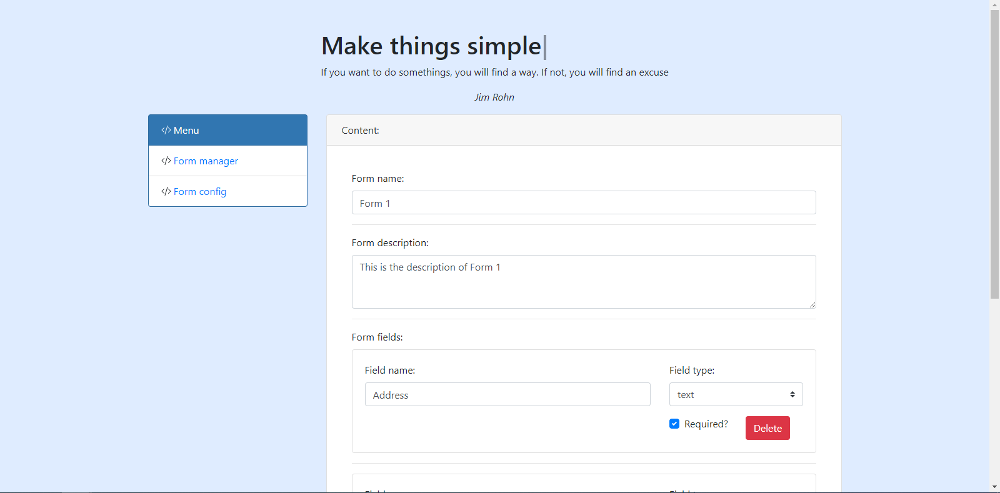
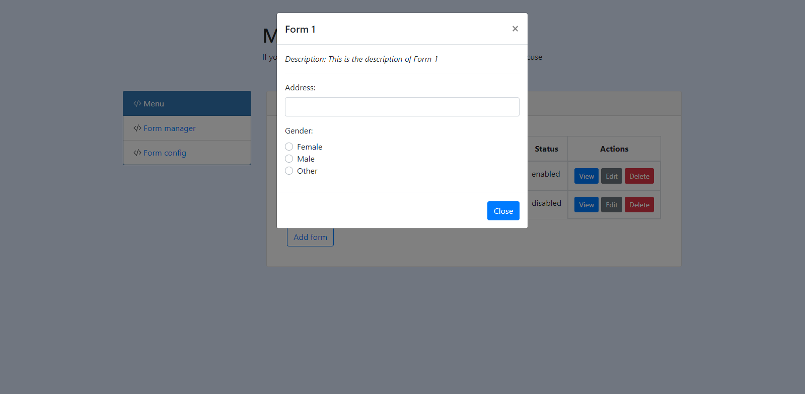
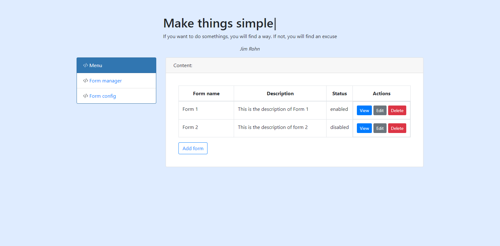

This repo is backend for JunctionX hackathon 2021 competition

## Project description
- This application let user design form and dynamic generating form for end user.
- Technology:
  - Java Spring boot
  - PostgreSQL
- API of project available here: https://sleepy-falls-53919.herokuapp.com/admin/forms/

## UI preview

## Postman collection
https://www.getpostman.com/collections/b08486d9194c494ddaa4

## Code structure

## Future update
Because of time limitation, we just prototype function to make application work as soon as possible.
If we have more time, we will upgrade this feature:
- Backend: Add middleware to auth user
- Backend: Add cache to improve performance
- Feature: Add some specific field type: url, email, country, province, zipcode,...